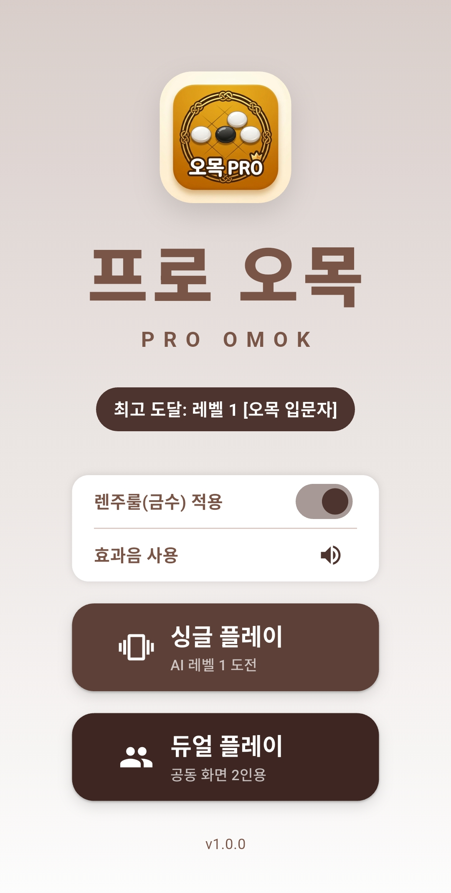
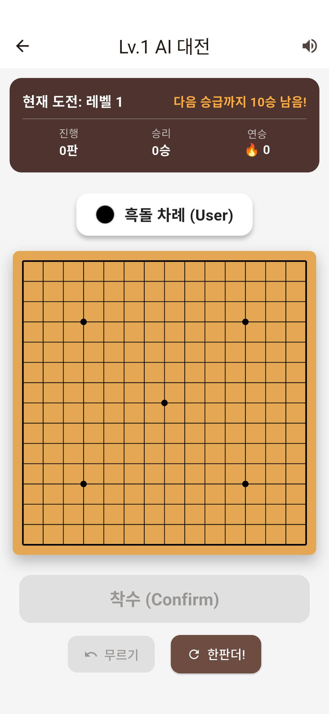
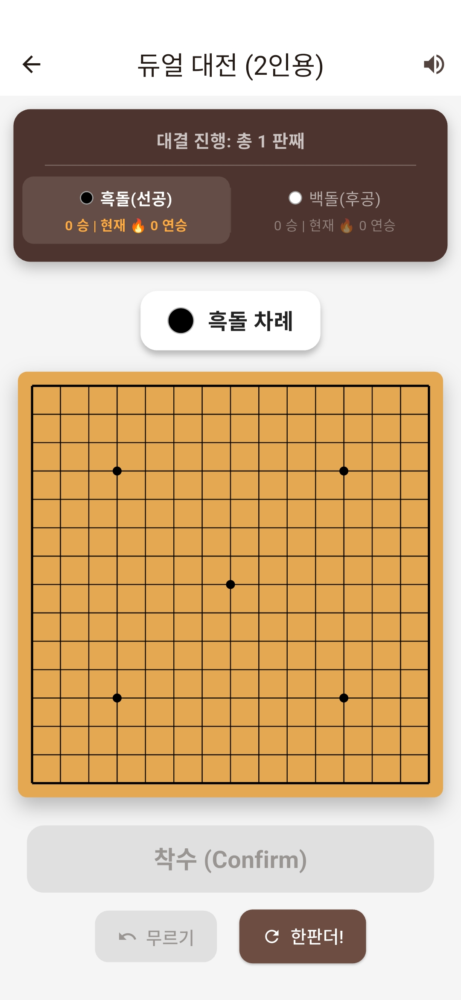
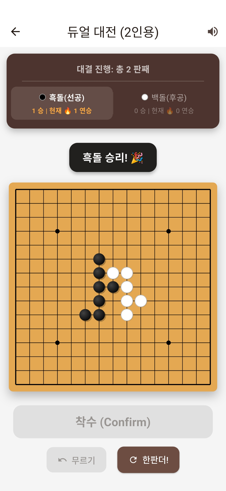

# 🏆 프로 오목 (Pro Omok) - Official Showcase

> **"가장 단순하지만 가장 깊이 있는 두뇌 싸움"**
> 정통 렌주룰을 탑재한 스타일리시 모바일 오목 게임, **'프로 오목'**에 오신 것을 환영합니다!
> 지금 바로 다운로드하여 스마트폰 하나로 친구와 마주 앉아 대국을 펼치거나, 강력한 AI의 한계에 도전해 보세요.

---

## 📸 게임 미리보기 (Screenshots)

눈이 편안한 미니멀 디자인과 정갈한 UI를 직접 확인해 보세요. 오직 수 싸움에만 온전히 집중할 수 있도록 완벽하게 설계되었습니다.

<table width="100%" style="border-collapse: collapse; border: none;">
  <tr style="border: none;">
    <td width="25%" align="center" style="border: none; padding: 8px;"><b>✨ 깔끔한 로비</b></td>
    <td width="25%" align="center" style="border: none; padding: 8px;"><b>🤖 스마트 AI 대전</b></td>
    <td width="25%" align="center" style="border: none; padding: 8px;"><b>👥 오프라인 2인용</b></td>
    <td width="25%" align="center" style="border: none; padding: 8px;"><b>🎉 짜릿한 승리!</b></td>
  </tr>
  <tr style="border: none;">
    <td style="border: none; padding: 5px;"></td>
    <td style="border: none; padding: 5px;"></td>
    <td style="border: none; padding: 5px;"></td>
    <td style="border: none; padding: 5px;"></td>
  </tr>
  <tr style="border: none;">
    <td align="center" style="border: none; font-size: 0.9em; color: #555; padding-top: 8px;">광고 없는 쾌적한 시작 <b>번거로운 가입 없이 즉시 구동</b></td>
    <td align="center" style="border: none; font-size: 0.9em; color: #555; padding-top: 8px;">단판으로 끝나지 않는 재미 <b>Lv.1 입문자 승급 도전</b></td>
    <td align="center" style="border: none; font-size: 0.9em; color: #555; padding-top: 8px;">터치 실수 방지 <b>안전한 '착수 확인' 시스템</b></td>
    <td align="center" style="border: none; font-size: 0.9em; color: #555; padding-top: 8px;">치열한 수 싸움의 결실 <b>무르기 및 짜릿한 연승 통계</b></td>
  </tr>
</table>

---

## 🎮 핵심 재미 포인트 (Game Highlights)

### ⚖️ 오목 고수들을 위한 '정통 렌주룰' 지원
먼저 두는 흑돌이 무조건 유리한 불공정함은 이제 끝! 
* **흑돌 금수 규칙:** 33, 44, 장연(6목 이상)이 완벽하게 제한됩니다.
* **백돌 무제한 공격:** 백돌은 금수 제한 없이 자유롭게 역공을 펼칠 수 있어 진짜 실력을 겨루는 치열한 밸런스를 제공합니다.
* *※ 원한다면 언제든 일반 친선 규칙으로 가볍게 토글하여 즐길 수도 있습니다.*

### 🤖 언제 어디서나 든든한 'AI 대전'
혼자서도 심심할 틈이 없습니다. 정교한 인공지능 알고리즘이 탑재된 AI와 대국을 펼쳐보세요. 연승을 쌓으며 다음 등급으로 승급하는 짜릿한 손맛을 경험할 수 있습니다.

### 👥 스마트폰 한 대로 함께 즐기는 '2인용 듀얼 플레이'
네트워크 연결이나 복잡한 친추 절차 없이, 카페나 거실에서 친구·가족과 스마트폰 한 대를 사이에 두고 나란히 앉아 즉석 대국을 즐기세요. 

### 🎧 디테일이 살아있는 편의 기능
바둑판 앞에 직접 앉은 듯 맑고 정갈하게 울리는 **착수 효과음**과 신중한 한 수를 위한 **무르기 기능**이 대국의 품격을 한층 더 높여줍니다.

---

## 🚀 지금 바로 다운로드하세요!

복잡한 로딩이나 불필요한 기능 없이, 오직 오목의 재미 본질에만 집중했습니다. 사양이 낮은 폰에서도 배터리 걱정 없이 가볍고 부드럽게 구동됩니다.

* **지원 환경:** Android 스마트폰 및 태블릿 완벽 지원
* **버전:** 최신 안정화 버전 v1.0.0

---
© 2026 프로 오목 (Pro Omok). All rights reserved.
