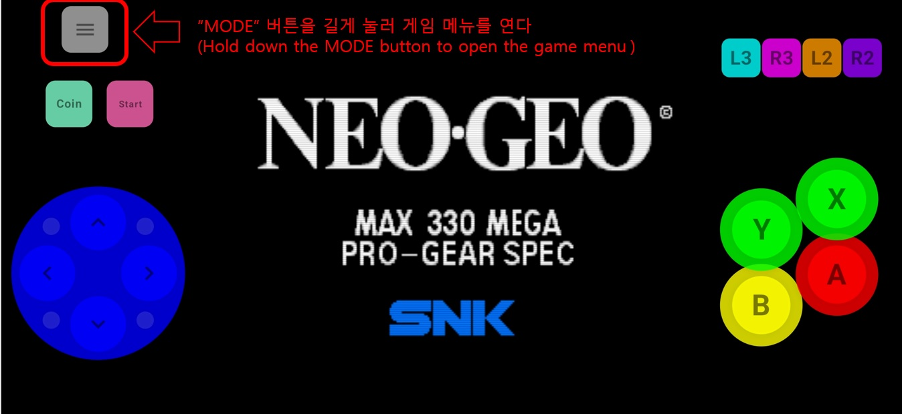

# 마크다운 내용 작성
markdown_content = """# 가상 컨트롤러 및 게임 메뉴 설정 사용설명서

이 문서에서는 에뮬레이터의 가상 컨트롤러 레이아웃을 편집하고 게임 내 기능을 사용하는 방법을 설명합니다.

---

## 1. 초기 화면 및 기본 인터페이스

  

* **설명:** * (여기에 초기 실행 화면 및 기본 버튼 배치에 대한 설명을 작성하세요.)

---

## 2. 게임 내 설정 메뉴 호출
**[파일명: cus_2.jpg]**
* **설명:** * (게임 메뉴에서 종료, 재시작, 음소거, 빨리 감기, 컨트롤 변경 등 주요 기능에 대한 설명을 작성하세요.)

---

## 3. 컨트롤 편집 모드 진입 및 간격 조절
**[파일명: cus_3.jpg]**
* **설명:** * (컨트롤 편집 모드에서 가로/세로 배치 간격 조절 및 이 게임에만 저장 옵션에 대한 설명을 작성하세요.)

---

## 4. 컨트롤 크기 및 기타 세부 설정
**[파일명: cus_4.jpg]**
* **설명:** * (전체 크기 조절 및 각 버튼의 세부적인 배치 설정 방법에 대해 작성하세요.)

---

## 5. 버튼 텍스트 수정 및 매크로 설정
**[파일명: cus_5.jpg]**
* **설명:** * (버튼의 텍스트를 변경하거나, 여러 입력을 하나로 묶는 매크로 조합 설정 방법에 대해 작성하세요.)

---

## 6. 버튼 개수 설정 및 기본값 초기화
**[파일명: cus_6.jpg]**
* **설명:** * (게임 환경에 맞게 버튼 개수를 2, 4, 6개로 변경하는 방법 및 디폴트 설정 복구에 대해 작성하세요.)

---

## 7. 버튼 색상 및 최종 매크로 저장
**[파일명: cus_7.jpg]**
* **설명:** * (버튼 색상 변경 기능과 최종적으로 매크로 설정을 완료하는 방법에 대해 작성하세요.)
"""

