# 오락실 게임 - 추억의 고전 게임을 스마트하게 즐기는 방법

  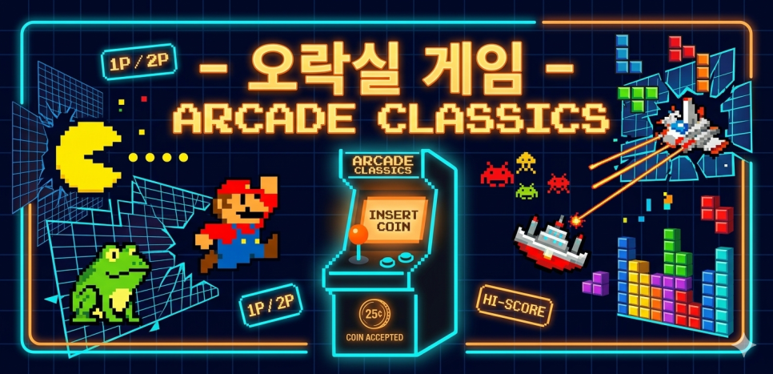

"어릴 적 오락실에서 즐기던 고전 게임들, 막상 스마트폰이나 PC로 하려니 설정도 복잡하고 게임 찾기도 힘드셨죠? 그런 불편함을 한 번에 해결하기 위해 제가 직접 개발한 **'오락실 게임'** 앱을 소개합니다."

---

## 주요 특징

* **직관적인 UI/UX:** 복잡한 설정 없이 누구나 쉽게 게임을 검색하고 실행할 수 있습니다.
* **최적화된 라이브러리 관리:** 수천 개의 게임을 깔끔하게 정렬하고 나만의 리스트를 만들 수 있습니다.
* **빠른 반응 속도:** 개발 과정에서 최적화에 공을 들여 쾌적한 구동 환경을 제공합니다.
* **커스터마이징 지원:** 사용자의 취향에 맞게 레이아웃이나 테마를 조절할 수 있습니다.
* **멀티플레이 지원:** 폰에 조이스틱 또는 패드를 여러 개 연결하면 여러 명이서 같이 즐길 수 있습니다.

---

> "기존 런처들을 사용하면서 아쉬웠던 점들을 모아, '내가 쓰고 싶은 앱'을 만들자는 생각으로 시작했습니다. 수많은 테스트를 거쳐 탄생한 만큼 안정성만큼은 자신 있습니다.
> 
> 추억의 게임들을 가장 세련되게 즐기는 방법, 지금 바로 **'오락실 게임'** 앱과 함께 시작해 보세요! 관련 문의나 피드백은 언제든 환영입니다."

---
### 🎮 기능 소개
<table width="100%" style="border-collapse: collapse; border: none;">
  <tr style="border: none;">
    <td width="25%" align="center" style="border: none; padding: 10px;"><b>게임목록 카드형</b></td>
    <td width="25%" align="center" style="border: none; padding: 10px;"><b>게임목록 리스트형</b></td>
    <td width="25%" align="center" style="border: none; padding: 10px;"><b>치트</b></td>
    <td width="25%" align="center" style="border: none; padding: 10px;"><b>자동연사</b></td>
    
  </tr>
  <tr style="border: none;">
    <td style="border: none; padding: 5px;">
      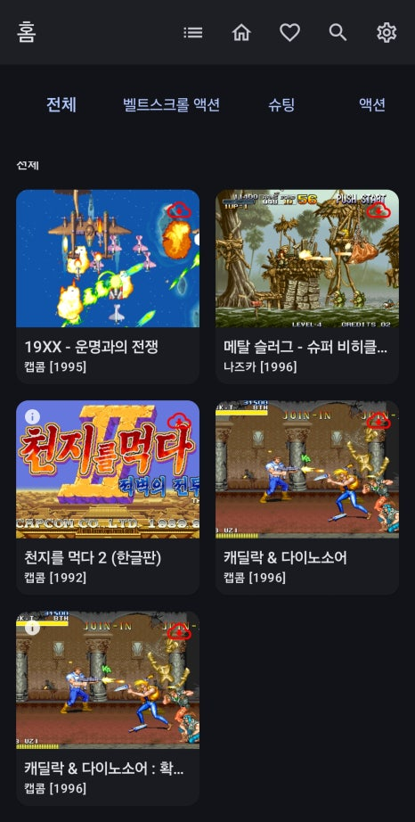
    </td>
    <td style="border: none; padding: 5px;">
      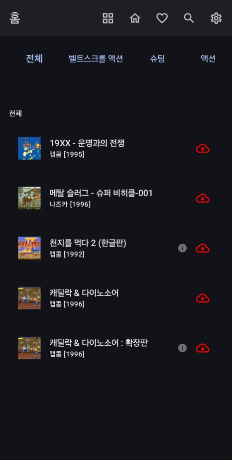
    </td>
     <td style="border: none; padding: 5px;">
      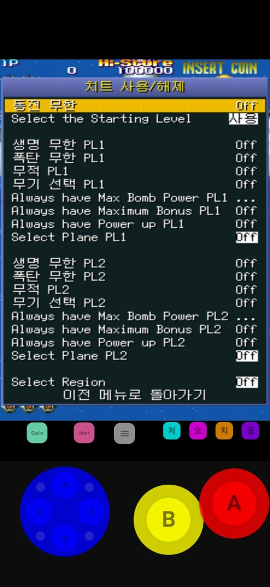
    </td>
     <td style="border: none; padding: 5px;">
      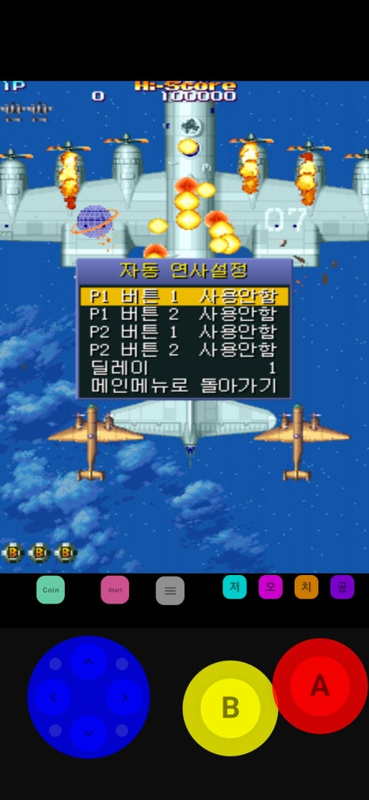
    </td>
  </tr>
</table>

<table width="100%" style="border-collapse: collapse; border: none;">
  <tr style="border: none;">
    <td width="50%" align="center" style="border: none; padding: 10px;"><b>공략보기</b></td>
    <td width="50%" align="center" style="border: none; padding: 10px;"><b>게임저장및 불러오기</b></td>
    
  </tr>
  <tr style="border: none;">
    <td style="border: none; padding: 5px;">
      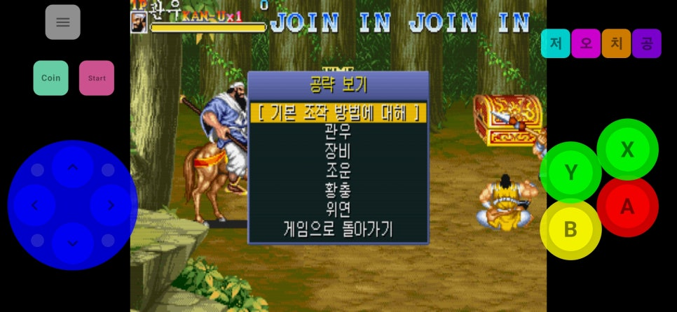
    </td>
    <td style="border: none; padding: 5px;">
      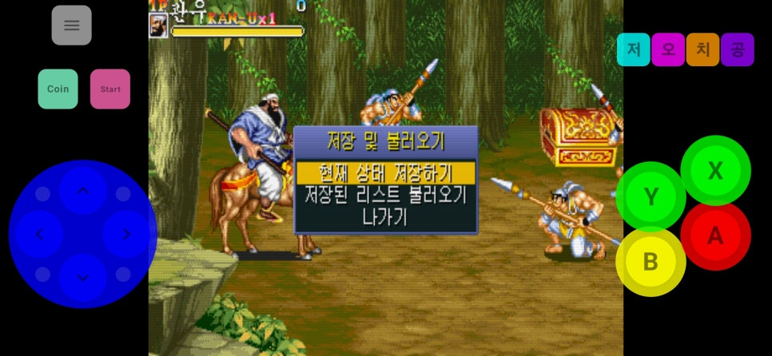
    </td>   
  </tr>
</table>

  
  
최대 4인용까지 함께(조이스틱 연결시)

---

## 다운로드 링크

* [Google Play 스토어 바로가기](https://play.google.com/store/apps/details?id=com.kazewa.eklauncher&pcampaignid=web_share)

---
📱 버튼 배열 수정 방법

<table width="100%" style="border-collapse: collapse; border: none;">
  <tr style="border: none;">
    <td style="border: none; padding: 5px;">
      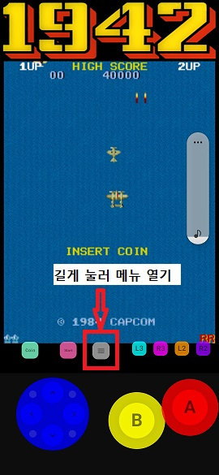
    </td>
    <td style="border: none; padding: 5px;">
      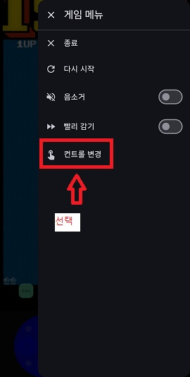
    </td>   
    <td style="border: none; padding: 5px;">
      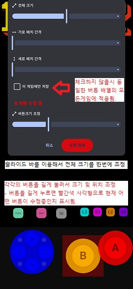
    </td>
  </tr>
</table>

📱 게임 삭제 방법
> 해당 게임을 길게 누르면 아래 그림처럼 메뉴가 나옵니다.
<table width="100%" style="border-collapse: collapse; border: none;">
  <tr style="border: none;">
    <td style="border: none; padding: 5px;">
      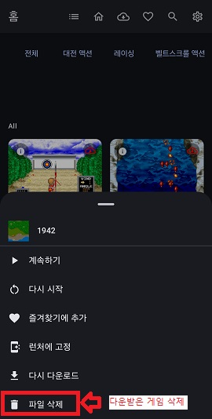
    </td>
  </tr>
</table>
