# 🛡️ 세이프 아이(SafeEye) 시작 가이드

세이프 아이는 자녀의 안전한 스마트폰 사용을 위해 강력한 보안 기능을 제공합니다. 앱을 처음 설치한 후, 아래 단계에 따라 보안 설정을 완료해 주세요.

## 1. 관리자 비밀번호 설정
자녀가 임의로 설정을 변경하거나 앱을 종료하지 못하도록 부모님만 아는 **4자리 비밀번호**를 설정해야 합니다.

| 단계 | 설명 | 스크린샷 |
| :--- | :--- | :--- |
| **01. 암호 정하기** | 앱 관리 시 사용할 **4자리 숫자**를 입력합니다. | 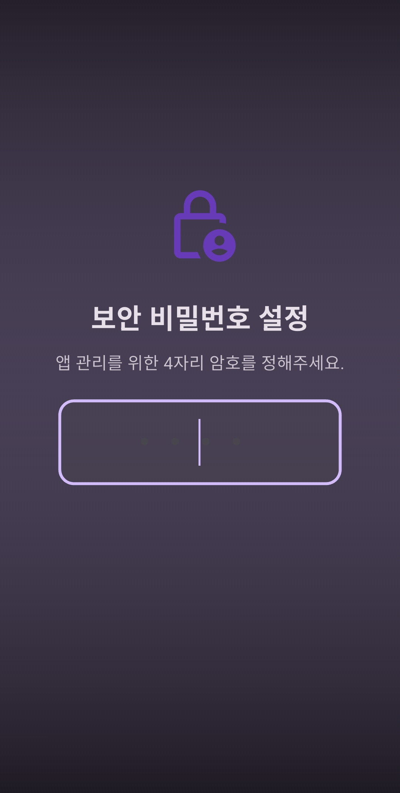 |
| **02. 암호 확인** | 실수 방지를 위해 앞에서 정한 암호를 **한 번 더** 입력해 주세요. | 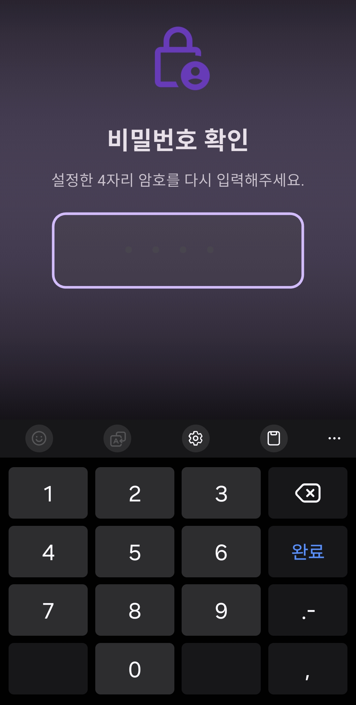 |
| **03. 보안 질문 설정** | 비밀번호를 잊어버렸을 경우를 대비해 **보안 질문**과 **정답**을 등록합니다. (오프라인 전용) | 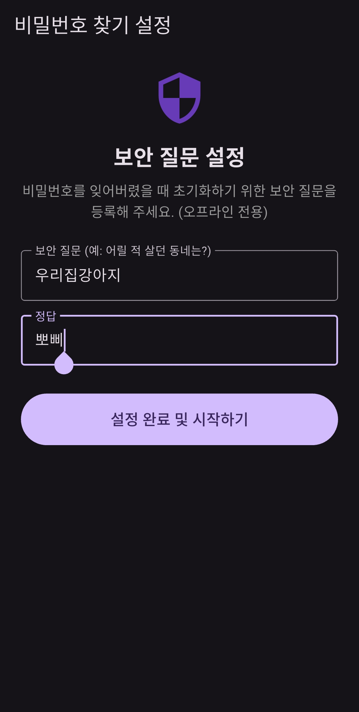 |

> **💡 주의사항:** 
> 설정하신 비밀번호는 앱의 모든 권한 관리와 삭제 방지에 사용됩니다. 자녀가 유추하기 어려운 번호로 설정해 주세요.

## 2. 우회 방지 감지 설정 (접근성 권한)

인앱 브라우저를 통한 콘텐츠 우회 시도를 실시간으로 감지하고 차단하기 위해 **접근성 권한** 설정이 반드시 필요합니다.

| 단계 | 설명 | 스크린샷 |
| :--- | :--- | :--- |
| **01. 설정 열기** | 보안 대시보드에서 [우회 방지 감시(접근성)] 항목의 **설정 열기** 버튼을 누릅니다. | 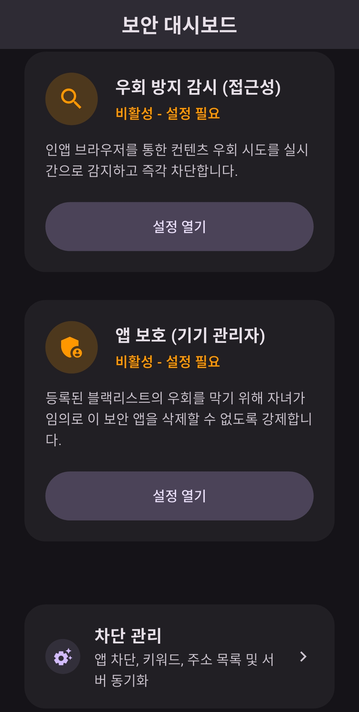 |
| **02. 시스템 설정 이동** | 안드로이드 시스템 설정의 [접근성] 메뉴에서 **설치된 앱**을 선택합니다. | 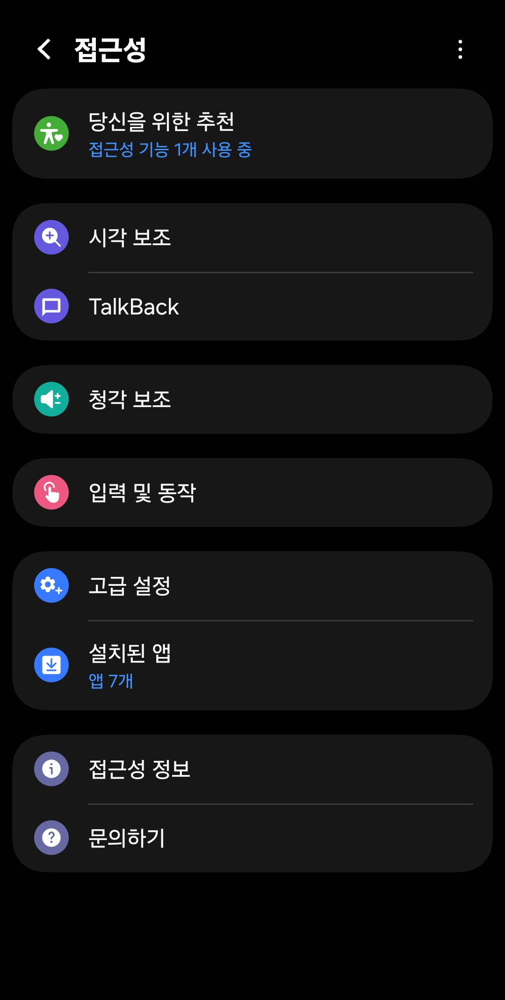 |
| **03. 서비스 선택** | 설치된 앱 목록 중 **노 가드(No Guard)** 서비스를 찾아 클릭합니다. | 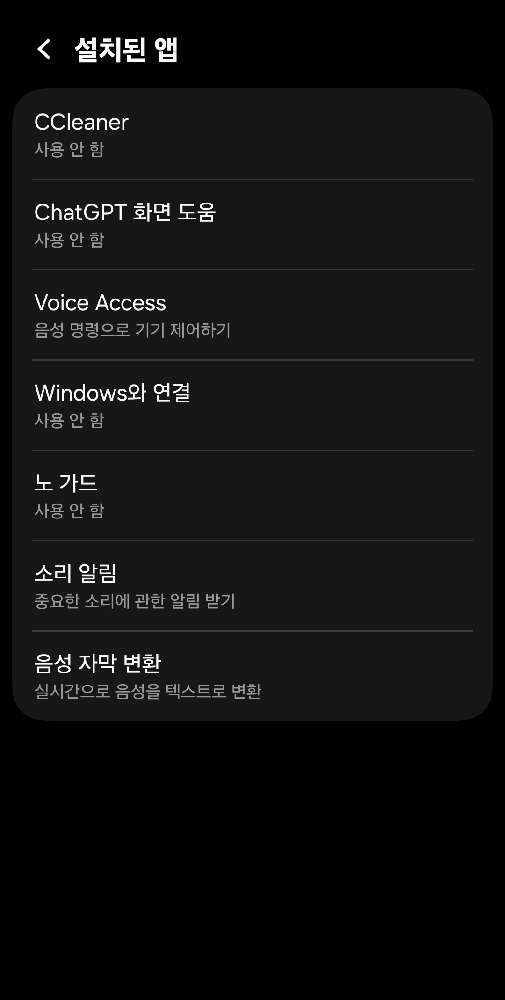 |
| **04. 권한 허용** | [사용 안 함] 스위치를 켜고, 하단에 나타나는 권한 요청 팝업에서 **허용**을 누릅니다. | 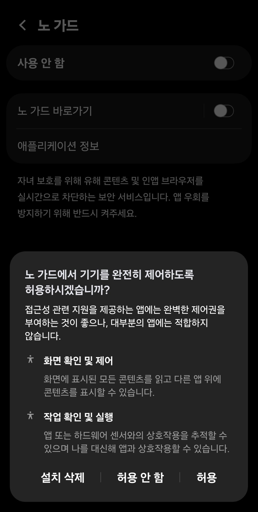 |

> **💡 참고사항:** 
> 부모 관리 모드가 활성화된 동안에는 설정 변경을 위해 우회 감시가 일시 정지될 수 있습니다. 설정을 모두 마친 후 앱을 닫으면 보호 기능이 즉시 재개됩니다.
> 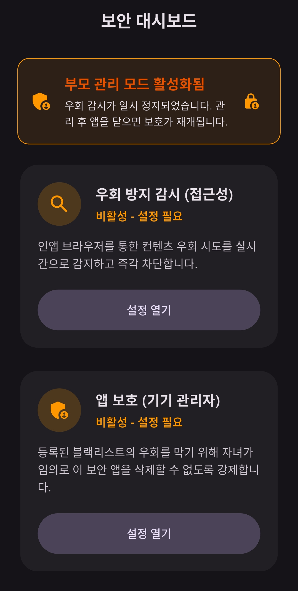

## 3. 앱 보호 설정 (기기 관리자 권한)

자녀가 임의로 보호 앱을 삭제하거나 설정을 우회하는 것을 방지하기 위해 **기기 관리자** 권한을 활성화해야 합니다.

| 단계 | 설명 | 스크린샷 |
| :--- | :--- | :--- |
| **01. 설정 열기** | 보안 대시보드에서 [앱 보호 (기기 관리자)] 항목의 **설정 열기** 버튼을 누릅니다. |  |
| **02. 권한 실행** | 시스템 팝업이 나타나면 앱 무단 삭제 방지 설명을 확인한 후 **실행**을 누릅니다. | 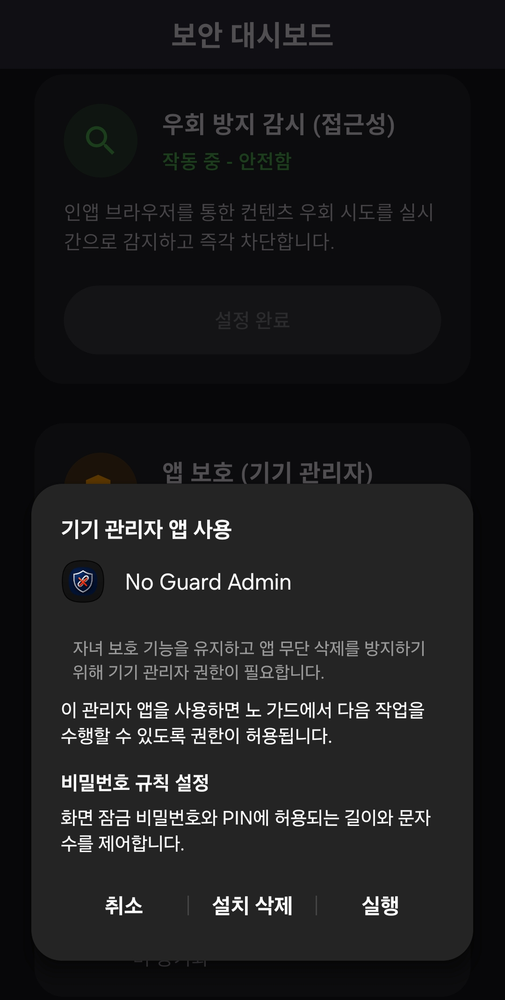 |

> **⚠️ 중요 알림:** 
> 이 권한이 활성화되면 부모님의 관리자 비밀번호 없이는 앱을 삭제할 수 없게 됩니다. 이는 자녀가 보호 환경을 임의로 해제하는 것을 막기 위한 필수 보안 조치입니다.

## 4. 보안 설정 완료 및 보호 활성화

모든 권한이 정상적으로 설정되면 **보안 대시보드**의 상태가 업데이트되며 실시간 보호가 시작됩니다.

| 상태 | 설명 | 스크린샷 |
| :--- | :--- | :--- |
| **보호 작동 중** | 모든 항목이 '작동 중 - 안전함'으로 표시되면 자녀의 기기가 안전하게 보호되고 있는 상태입니다. | 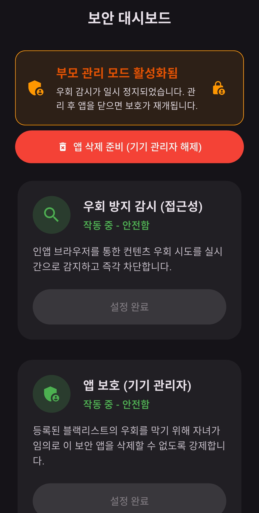 |

### ✅ 체크리스트
*   **우회 방지 감시:** '작동 중' 상태인지 확인하세요. 인앱 브라우저를 통한 유해물 접근을 실시간으로 차단합니다.
*   **앱 보호:** '작동 중' 상태라면 자녀가 임의로 앱을 삭제할 수 없습니다.
*   **앱 삭제가 필요한 경우:** 상단의 [앱 삭제 준비 (기기 관리자 해제)] 버튼을 눌러 부모 관리자 인증 후 안전하게 삭제 절차를 진행할 수 있습니다.

---
**이제 세이프 아이가 자녀의 안전한 디지털 환경을 지켜줍니다!**

## 5. 차단 관리 및 필터링 설정

세이프 아이는 강력한 필터링 엔진을 통해 유해 콘텐츠를 차단합니다. 부모님이 직접 차단 목록을 관리하거나 서버에서 최신 목록을 가져올 수 있습니다.

| 주요 기능 | 설명 | 스크린샷 |
| :--- | :--- | :--- |
| **차단 관리 메인** | 앱, 키워드, 주소 차단 등 모든 필터링 설정을 한눈에 관리합니다. | 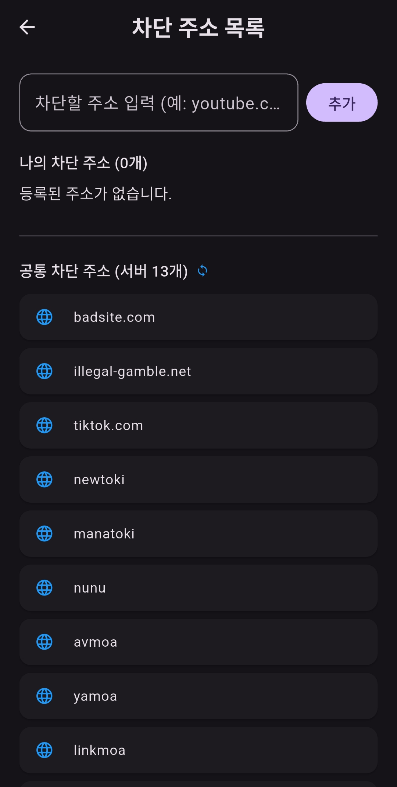 |
| **앱 차단 설정** | 자녀의 기기에 설치된 앱 중 특정 앱의 실행을 제한할 수 있습니다. | 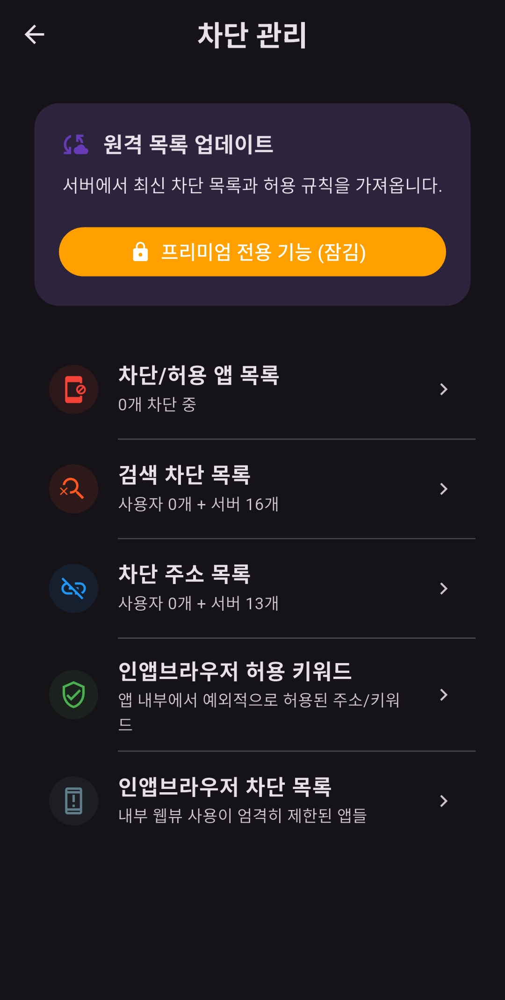 |
| **검색 차단 목록** | 유해한 검색어나 키워드를 등록하여 콘텐츠 접근을 원천 차단합니다. |  |
| **차단 주소 목록** | 특정 웹사이트 URL을 직접 등록하여 접속을 금지합니다. | 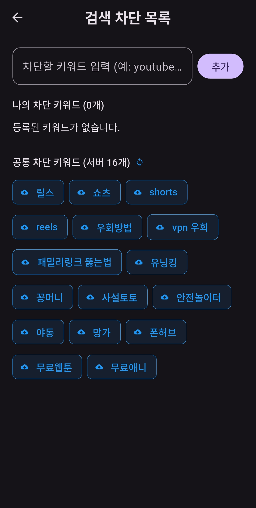 |

### 🔍 필터링 상세 안내
*   **원격 목록 업데이트:** 서버에서 실시간으로 업데이트되는 최신 유해물 DB를 가져옵니다. (프리미엄 전용)
*   **공통 차단 키워드:** '릴스', '쇼츠', '우회방법' 등 기본적으로 제공되는 강력한 서버 차단 목록을 활용할 수 있습니다.
*   **사용자 정의 목록:** 부모님이 개별적으로 '나의 차단 키워드'나 '나의 차단 주소'를 추가하여 관리할 수 있습니다.

---
**💡 팁:** 
인앱 브라우저 차단 목록 기능을 활용하면, 카카오톡이나 페이스북 내부에서 열리는 웹뷰(WebView) 페이지까지 정밀하게 통제할 수 있습니다.
