# 📦 Travel Canvas

## 1. 📝 앱 이름 및 간단한 설명
* **앱 이름**: Travel Canvas (트래블 캔버스)
* **간단한 설명**: 전 세계 어디든 한글로 계획하고, 나만의 특별한 여행 코스를 기록하는 스마트한 여행 플래너!

  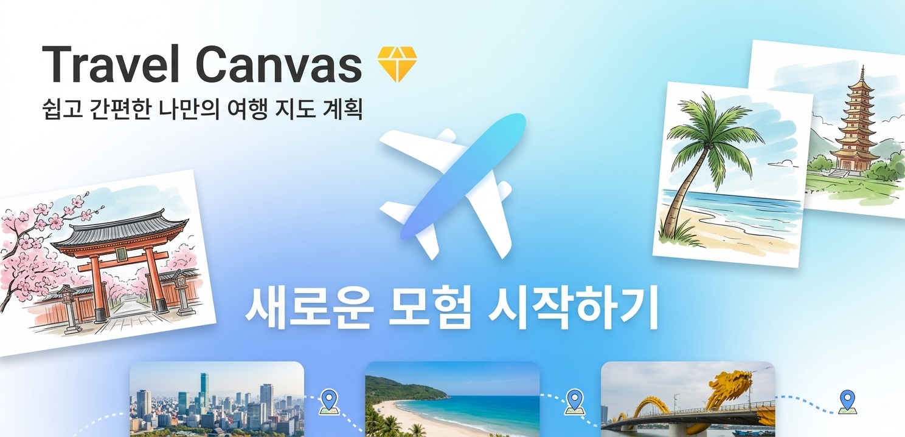

---

## 2. 📖 앱 상세 설명 (Full Description)

**"여행의 모든 순간을 캔버스에 담다, Travel Canvas"**

계획부터 기록까지, 여행자에게 꼭 필요한 기능만 꽉 채웠습니다. 복잡한 영어 주소 검색이나 글자 깨짐 걱정 없이, 이제 모든 여행을 한글로 편하게 관리하세요.

### ✨ Travel Canvas만의 핵심 기능

**1. 전 세계 어디든 '한글'로 검색하세요**
* 외국 장소도 한글로 검색하면 척척! 스마트한 자동 번역 시스템이 글로벌 POI 데이터를 찾아 한글로 보여줍니다.

  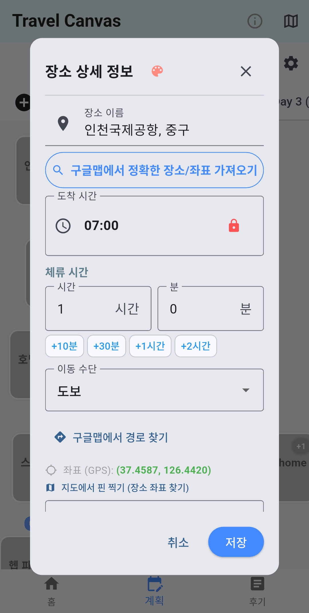 &nbsp;&nbsp;&nbsp;&nbsp; 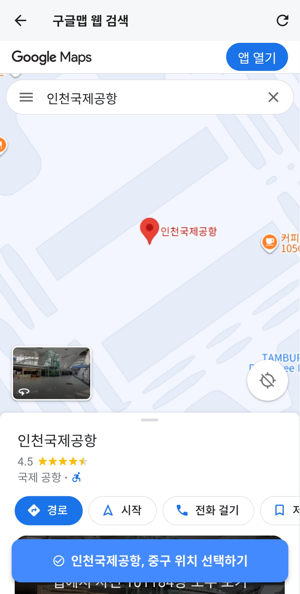

**2. 똑똑한 자동 시간 체이닝**
* 체류 시간만 입력하세요. 다음 일정의 도착 시간을 앱이 알아서 계산해 드립니다. 일정 변경 시 전체 타임라인이 자동으로 업데이트되어 계획이 훨씬 쉬워집니다.

  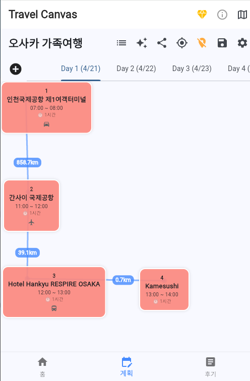 &nbsp;&nbsp;&nbsp;&nbsp; 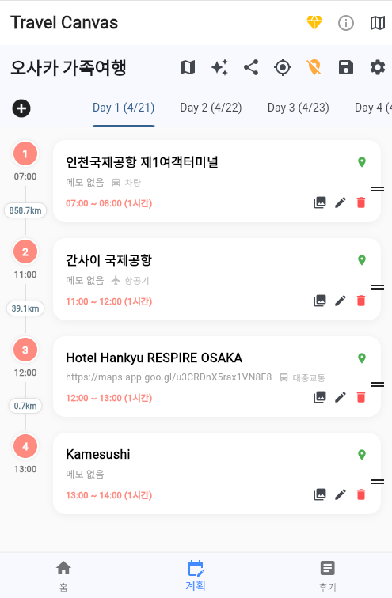

**3. 한눈에 보는 동선 지도 (Premium)**
* 내가 갈 곳들이 지도 위에 어떻게 연결되는지 확인하세요. 지점 간의 거리와 전체 이동 경로를 직관적으로 파악할 수 있습니다.

  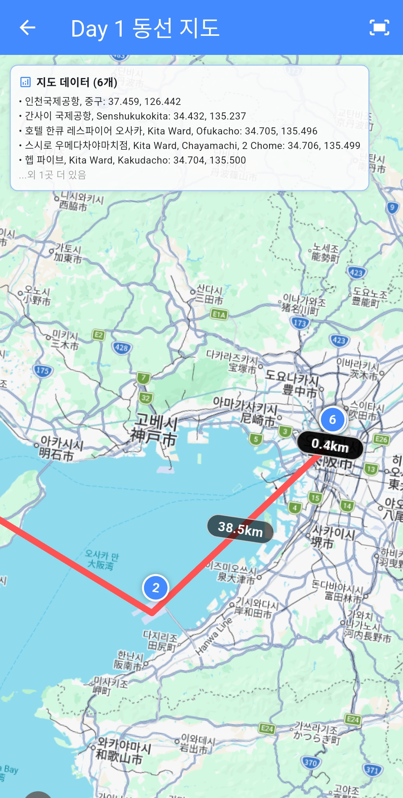 &nbsp;&nbsp;&nbsp;&nbsp; 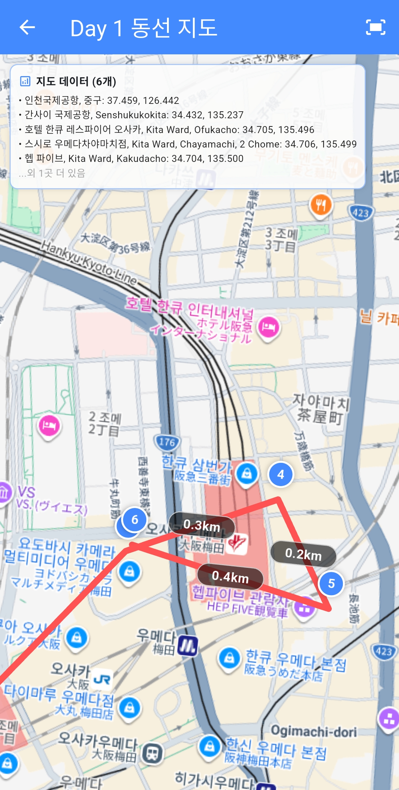

**4. 꼼꼼한 경비 및 체크리스트 관리**
* 화폐 단위별 간이 가계부와 짐 싸기 체크리스트 기능을 통해 여행 준비부터 실전까지 빈틈없이 챙길 수 있습니다.

  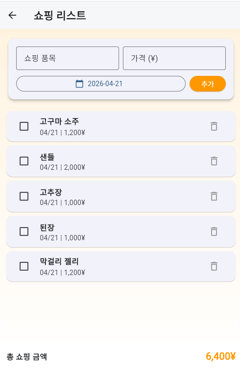 &nbsp;&nbsp;&nbsp;&nbsp; 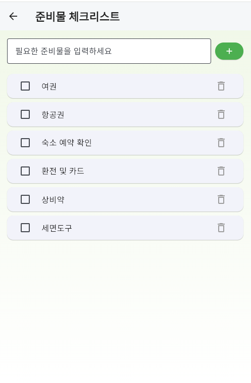

**5. 사진 자동 매칭**
* 여행 중 찍었던 사진을 불러오면, 여행 계획에 맞춰 자동으로 매칭을 시켜줍니다.
* 공유하기 기능을 통해 ZIP파일로 여행 일정별 폴더로 자동 분류되서 내려 받을수 있습니다.

  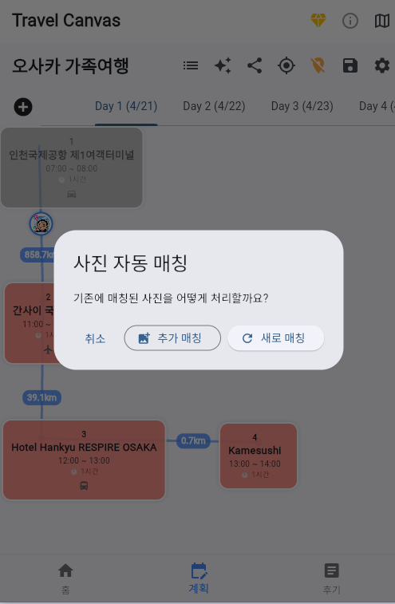

**5. 기록 공융 (이미지, 데이터, 기록백업, 사진 공유)**
* 열심히 작성한 여행 계획을 이미지로 간단하게 공유하거나, 데이터로 공유하여 "기록가져오기"기능을 통해 일행이 일정을 수정하고 다시 공유할수 있습니다.
* 기본적으로 자동 백업이 되지만, 그래도 불안하니 직접 기기로 파일로 백업을 하여 이중 안전 장치를 만들었습니다.
* 여행 일정별 자동 분류된 사진을 간단하게 폴더별로 정리하여 ZIP파일로 내려 받을수 있습니다.

  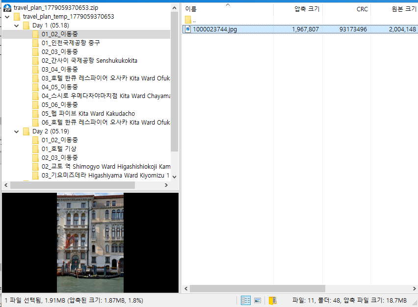 &nbsp;&nbsp;&nbsp;&nbsp; 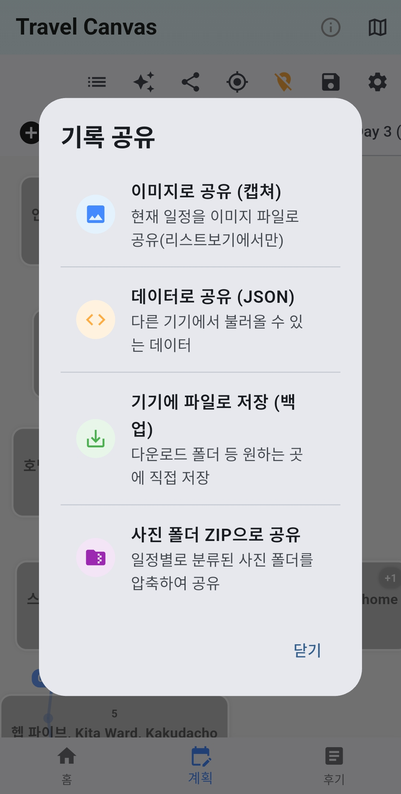

**6. AI 후기 생성 및 나만의 여행 캔버스 (Premium)**
* 추억이 담긴 메모와 사진을 바탕으로 AI가 멋진 여행 후기를 요약해 드립니다. 완성된 일정표는 이미지로 저장해 친구들에게 공유할 수 있습니다.

  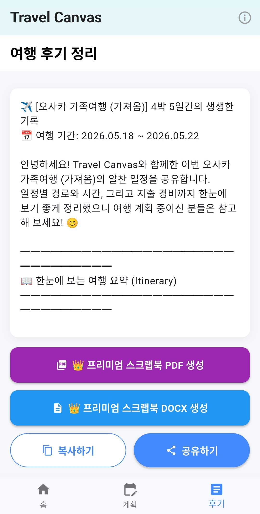 &nbsp;&nbsp;&nbsp;&nbsp; 

  

---

## 3. 👑 프리미엄 혜택 (Premium Membership)
* **광고 없는 쾌적한 환경**: 앱 사용 중 노출되는 광고 배너가 모두 제거됩니다.
* **동선 및 거리 확인**: 지도에서 지점 간의 상세 연결 선과 km 거리 정보를 무제한으로 확인 가능합니다.
* **AI 후기 자동 요약**: 긴 여행 기록을 AI가 깔끔하게 요약해 주는 기능을 무제한으로 사용하세요.
* **한 번 결제로 평생 소장**: 구독형이 아닌 '평생 소장형' 상품으로 단 한 번의 결제만으로 모든 혜택을 누리세요!

---

## 📞 개발자 연락처 & 지원
* **개발자**: travelcanvas
* **이메일**: contact-travelcanvas@naver.com
* **개인정보처리방침**: [앱 내 정보 페이지 참조]
